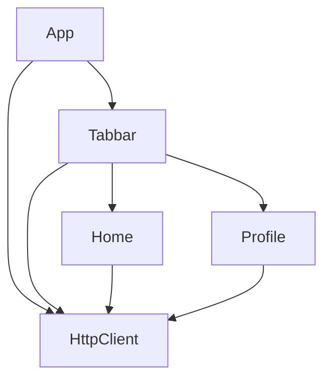

# Dependency Injection in Dart/Flutter

## Background & motivation
It's hard to find a well structured solution for dependency injection that doesn't use a service locator approach.
To use a service locator tool as main dependency injection solution, we need a well structured solution, linters, etc

## The issue with current most adopted solutions
Service locator
Requires an implicit order when registering the dependencies
Scaling, maintenance

## Composition Root
todo: link references



```dart
// root module
class AppCompositionRoot implements TabBarExternalCompositionRoot {
  HttpClient makeHttpClient() => HttpClient();

  TabBarFeature makeTabBar() => TabBarFeature(dependencies: this);
}

// tabbar module
abstract class TabBarExternalCompositionRoot implements HomeFeatureExternalCompositionRoot {

}

class TabBarCompositionRoot {
  TabBarCompositionRoot({
    required this.dependencies,
  });

  final TabBarExternalCompositionRoot dependencies;

  HomeFeature makeHome() => HomeFeature(dependencies: dependencies);
}

// home module
abstract class HomeFeatureExternalCompositionRoot {
  HttpClient makeHttpClient();
}

class HomeFeatureCompositionRoot {
  HomeFeatureCompositionRoot({
    required this.dependencies,
  });
  
  final HomeFeatureExternalCompositionRoot dependencies;

  HomeScreen makeScreen() => HomeScreen(bloc: makeBloc());

  HomeBloc makeBloc() => HomeBloc(
    httpClient: dependencies.makeHttpClient(),
    otherDependencies: makeDeps(),
  );

  // ...
}
```